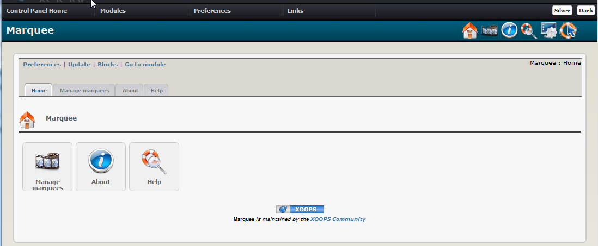

# Introduction

## XOOPS Marquee 2.50

#### for XOOPS 2.5.7

### User Manual

© 2016 XOOPS Project \([www.xoops.org](http://xoops.org)\)

### Module Purpose

Marquee is a XOOPS module to create scrolling texts \(marquees\). You can create an unlimited number of marquees and use them in 4 blocks. Texts can scroll horizontally \(from right to left or left to right\) and vertically \(from top to bottom and bottom to top\) You can also set the loop, i.e. how many times should the marquee loop \(from 1 to 100 times, and infinity\).

 _Figure 1 Main view of the Marquee Module \(Admin side\)_

### Download/Fork the Module 

**You can fork the module --&gt;** [**here**](https://github.com/XoopsModules25x/marquee)**\)**

### How to Contribute

[You can contribute on GitHub](https://github.com/XoopsDocs/marquee-tutorial). Changes will be [pushed to Gitbook.io automatically](https://www.gitbook.com/book/xoops/marquee-tutorial/activity) when the [main repository](https://github.com/XoopsDocs/marquee-tutorial) changes.

Editing the book can be done either by updating the markdown files with a text editor, or opening the repository in [the Gitbook desktop app](https://github.com/GitbookIO/editor/blob/master/README.md). The desktop app will give you a live preview option.

## Table of Content

* [Install/Uninstall](install-uninstall.md)
* [Administration Menu](administration-menu.md)
* [Preferences](preferences.md)
* [Operating Instructions](operating-instructions.md)
* [The User Side](the-user-side.md)
* [Blocks](blocks.md)
* [Templates](templates.md)
* [Miscellaneous](https://github.com/xoops/xoops-marquee-module/tree/532116f2aa038fce1ffab4decb619e8667613fef/en/book/8other.md) 
* [Module Credits](module-credits.md)
* [About XOOPS CMS](about-xoops-cms.md)

### License:

  
Unless specified, this content is licensed under a [Creative Commons Attribution-NonCommercial-ShareAlike 4.0 International License](http://creativecommons.org/licenses/by-nc-sa/4.0/).

All derivative works are to be attributed to XOOPS Project \([www.xoops.org](http://xoops.org)\)

