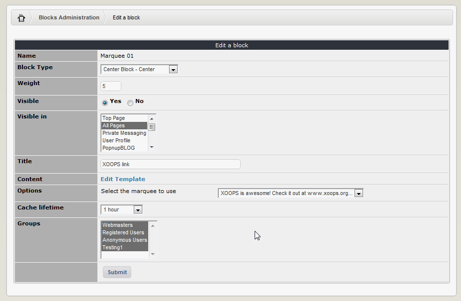
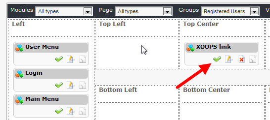
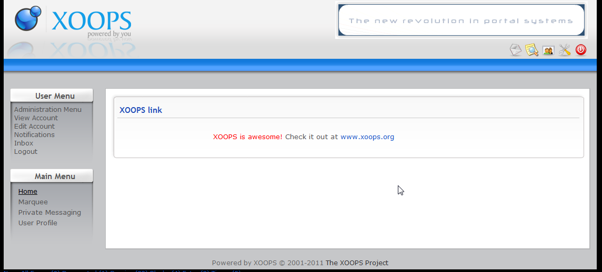

# 4.0 Operating Instructions

This module and its operations are very simple: 
1.	Configure your preferences (e.g. select the text editor)
2.	Add a Marquee
3.	Select a block you want this Marquee to be visible and set desired options

We covered the Preferences above. 

To add a new Marquee, go to the “Manage Marquees” Tab and click on the “Add a Marquee”. The following screen opens:

 
_Figure 8 Configuring the Marquee_

Now we’ll add the text for our Marquee, and change some of the colors. The advantage of the WYSIWYG editor such as TinyMCE is that this is a very easy process. We’ll also change the direction to:  Right->Left.
 
 
_Figure 9 Configured Marquee_

After we’re done, click on “Add” and we’re done. 
You can check if the system has recorded your Marquee by going to the “Manage Marquees” tab:

 
_Figure 10 List of existing Marquees_

And yes, it is saved correctly. 
Now it’s time to make the Marquee visible.
This is done by using Blocks (see the section Blocks for more information). 
When you click on the top menu “Blocks” you’ll be redirected to the Blocks screen, with the Marquee blocks already selected for you:    

 
Marquee Module provides you with four blocks. Of course, you could clone them and add more of them. 
First, lets move the “Marquee 01” to the Top Center, and click on Edit:
 

Now the “Block Edit” screen will open up:

  
These are the options that we need to change:

After we’re done with setting the option, the screen would look like this:

Let’s submit it now by clicking on “Submit” button. The block is now visible, as you can see from the green checkmark. 

## 
Once the block is set correctly and made visible, the Marquee can be seen in action on the User side:

 

_Figure 11 Marquee seen live on the your Website_