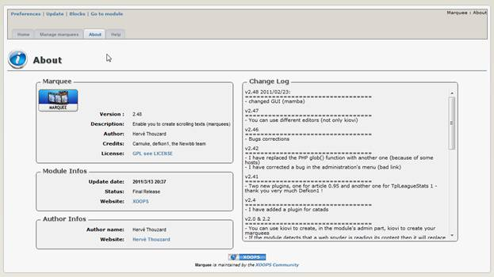
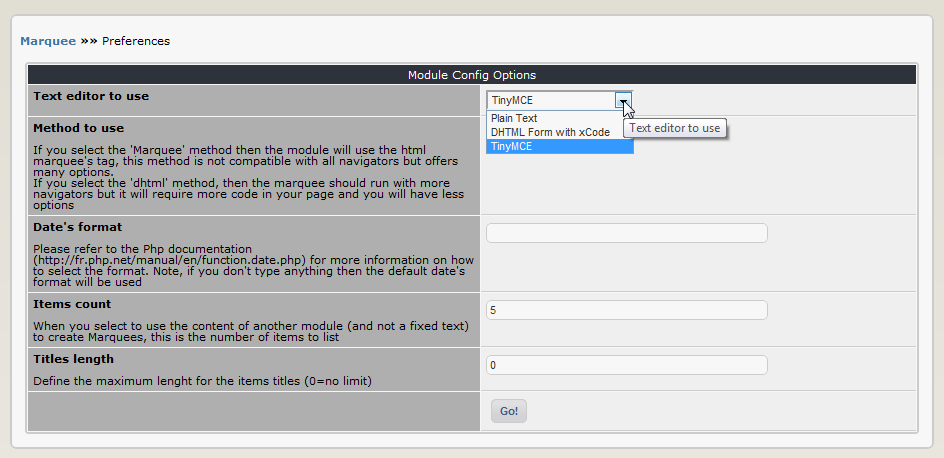

### _XOOPS Documentation Series_

# XOOPS Marquee 2.50
#### for XOOPS 2.5.7
  
      

            
                
                
    
## User Manual
  
  
  
  
  
© 2014 The XOOPS Project (www.xoops.org)    
  
  
### Table of Contents

- MODULE PURPOSE
- INSTALL/UNISTALL
- ADMINISTRATION MENU
- PREFERENCES
- OPERATING INSTRUCTIONS
- THE USER SIDE
- BLOCKS
- TEMPLATES
- MODULE CREDITS

### Table of Figures

* FIGURE 1 MAIN VIEW OF THE MARQUEE MODULE (ADMIN SIDE)	4
* FIGURE 2 THE MODULE ADMINISTRATION AND INSTALLATION	5
* FIGURE 3 THE MODULE ADMINISTRATION AND UNINSTALLATION	5
* FIGURE 4 VIEW OF THE “MANAGE MARQUEES” TAB	6
* FIGURE 5 THE “ABOUT THE MODULE” TAB	6
* FIGURE 6 THE “HELP” TAB	6
* FIGURE 7 THE PREFERENCES OPTIONS	7
* FIGURE 8 CONFIGURING THE MARQUEE	8
* FIGURE 9 CONFIGURED MARQUEE	9
* FIGURE 10 LIST OF EXISTING MARQUEES	9
* FIGURE 11 MARQUEE SEEN LIVE ON THE YOUR WEBSITE	13

 

## Module Purpose 

 
Marquee is a XOOPS module to create scrolling texts (marquees). You can create an unlimited number of marquees and use them in 4 blocks. Texts can scroll horizontally (from right to left or left to right) and vertically (from top to bottom and bottom to top)
You can also set the loop, i.e. how many times should the marquee loop (from 1 to 100 times, and infinity).

 

_Figure 1 Main view of the Marquee Module (Admin side)_

## Install/Unistall

No special measures necessary, follow the standard installation process – extract the module folder into
the /modules directory. Install the module through Admin -> Modules -> Install Modules (see below). 
 
_Figure 2 The Module Administration and Installation_

Detailed instructions on installing modules are available in the XOOPS Operations Manual. 
To uninstall the module, just click on the red arrow:

 
_Figure 3 The Module Administration and uninstallation_

## Administration Menu
There are four options on top:

There are four Tabs in the Administration of the Marquee module: 
•	Home
•	Manage Marquees
•	About 
•	Home

_Figure 4 View of the “Manage Marquees” Tab_

 
_Figure 5 The “About the Module” Tab_

 
_Figure 6 The “Help” Tab_

## Preferences
In the Preferences, you can set the most important options for the module, such as the text editor 

 
_Figure 7 The Preferences options_

## Operating Instructions
This module and its operations are very simple: 
1.	Configure your preferences (e.g. select the text editor)
2.	Add a Marquee
3.	Select a block you want this Marquee to be visible and set desired options

We covered the Preferences above. 

To add a new Marquee, go to the “Manage Marquees” Tab and click on the “Add a Marquee”. The following screen opens:

 
_Figure 8 Configuring the Marquee_

Now we’ll add the text for our Marquee, and change some of the colors. The advantage of the WYSIWYG editor such as TinyMCE is that this is a very easy process. We’ll also change the direction to:  Right->Left.
 
 
_Figure 9 Configured Marquee_

After we’re done, click on “Add” and we’re done. 
You can check if the system has recorded your Marquee by going to the “Manage Marquees” tab:

 
_Figure 10 List of existing Marquees_

And yes, it is saved correctly. 
Now it’s time to make the Marquee visible.
This is done by using Blocks (see the section Blocks for more information). 
When you click on the top menu “Blocks” you’ll be redirected to the Blocks screen, with the Marquee blocks already selected for you:    

 
Marquee Module provides you with four blocks. Of course, you could clone them and add more of them. 
First, lets move the “Marquee 01” to the Top Center, and click on Edit:
 

Now the “Block Edit” screen will open up:

  
These are the options that we need to change:

After we’re done with setting the option, the screen would look like this:

Let’s submit it now by clicking on “Submit” button. The block is now visible, as you can see from the green checkmark. 

## 
Once the block is set correctly and made visible, the Marquee can be seen in action on the User side:

 

_Figure 11 Marquee seen live on the your Website_

## The User Side
There is no functionality on the User side.

## Blocks
There are four predefined blocks to show your Marquees. 

## Templates
This module uses 
•	two templates for About and Help screens in the Administration, and 
•	four templates for its four blocks  

## Module Credits
This module was originally created by Hervé Thouzard.