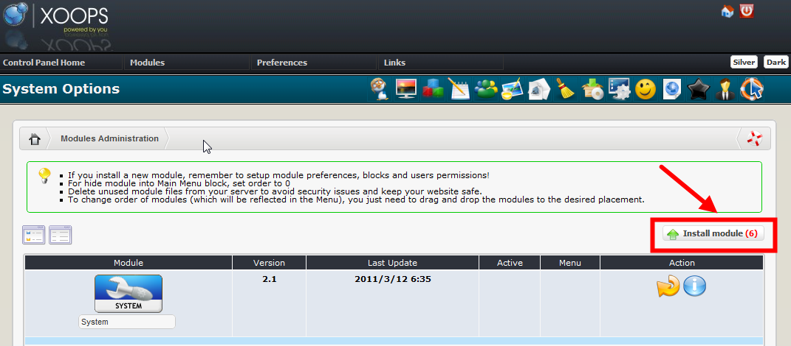
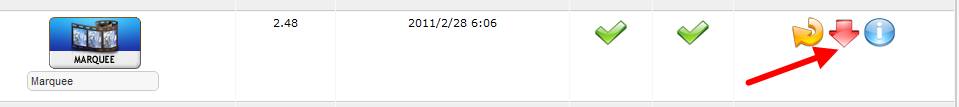

# 1.0 Install/Uninstall

No special measures necessary, follow the standard installation process – extract the module folder into
the /modules directory. Install the module through Admin -> Modules -> Install Modules (see below). 

  
*Figure 2 The Module Administration and Installation*

Detailed instructions on installing modules are available in the XOOPS Operations Manual. 
To uninstall the module, just click on the red arrow:

   
*Figure 3 The Module Administration and uninstallation*