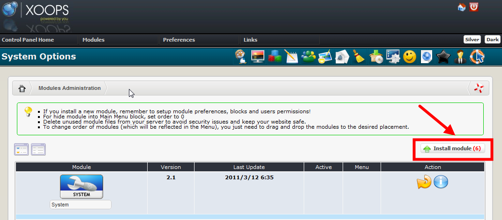
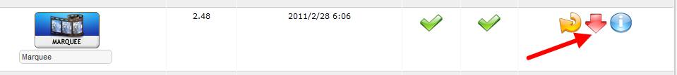

# Install/Uninstall

No special measures necessary, follow the standard installation process – extract the module folder into the /modules directory. Install the module through Admin -&gt; Modules -&gt; Install Modules \(see below\).

  
_Figure 2 The Module Administration and Installation_

Detailed instructions on installing modules are available in the XOOPS Operations Manual. To uninstall the module, just click on the red arrow:

  
_Figure 3 The Module Administration and uninstallation_

